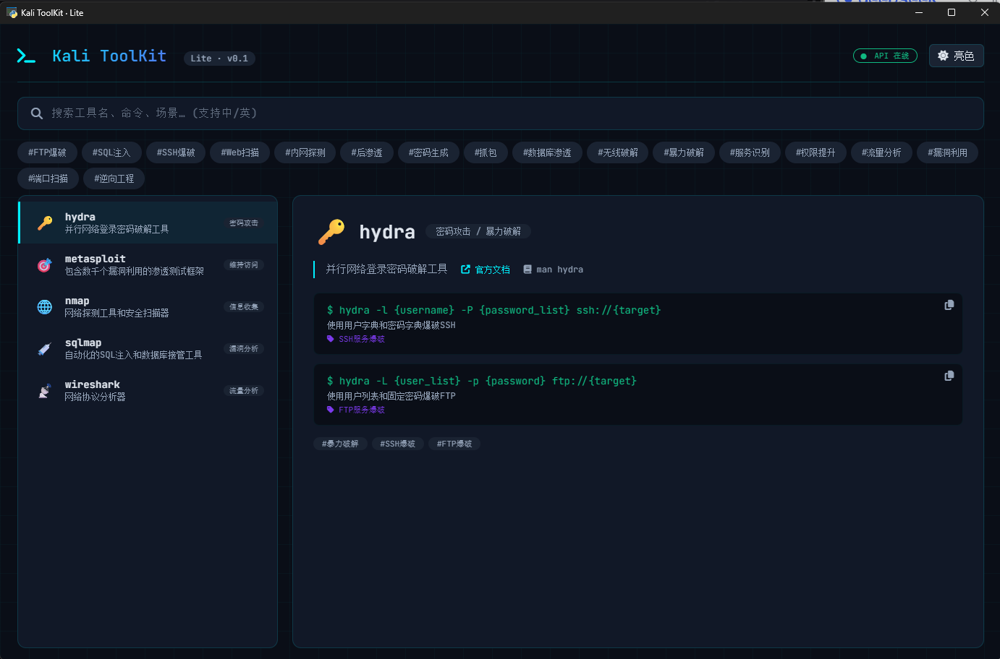

# 🐉 Kali ToolKit

> Kali Linux 工具百科全书 · 离线极客版

[](https://github.com/sheyunyang/kali-toolkit/releases)
[](LICENSE)

## ✨ 功能特性

- 📚 **完整工具库**：781 个 Kali Linux 工具，覆盖 8 大类
- 🔍 **智能搜索**：支持中英文、命令片段、标签搜索
- 💻 **详细命令**：2053 条命令示例，全部中文说明
- 🎨 **极客界面**：暗色/亮色双主题，电影级启动动画
- 🔒 **离线运行**：无需联网，绿色免安装

## 📥 下载

从 [Releases](https://github.com/sheyunyang/kali-toolkit/releases) 页面下载：

| 平台 | 文件名 | 大小 |
|------|--------|------|
| Windows 64-bit | `KaliToolKit.exe` | 约 20 MB |

## 🚀 快速开始

1. 下载 `KaliToolKit.exe`
2. 双击运行（**无需安装**）
3. 等待启动动画（约 25 秒）
4. 开始探索 781 个 Kali 工具

**提示**：首次启动需 10-20 秒解压；如被杀软误杀请添加信任。

## 🖼️ 截图



## 🛠️ 本地开发

```bash
git clone https://github.com/sheyunyang/kali-toolkit.git
cd kali-toolkit
python -m venv venv
.\venv\Scripts\activate
pip install -r requirements.txt
python app.py
🎨 技术栈
层	技术
前端	Vue 3 + 原生 CSS（极客风）
后端	FastAPI + SQLite + FTS5
桌面	PyWebView
打包	PyInstaller
数据来源	Kali 官网 + DeepSeek API 翻译
🗺️ 路线图
☑ v0.1.0 — 基础功能（781 工具 + 搜索 + 命令说明）
□ v0.2.0 — 检查更新功能 + 分类优化
□ v0.3.0 — 工具收藏 + 搜索历史
□ v1.0.0 — 全平台支持 + 自动更新
🙏 致谢
Kali Linux — 最好的网络安全系统

DeepSeek — 提供 AI 翻译支持

OffSec — 开源安全社区

⚠️ 免责声明
本项目仅供授权的网络安全测试和教育使用。使用者需遵守当地法律法规，不得用于非法用途。作者不对任何滥用行为负责。

📄 许可证
MIT License - 详见 LICENSE
Made with ❤️ by 黑盒实验室
