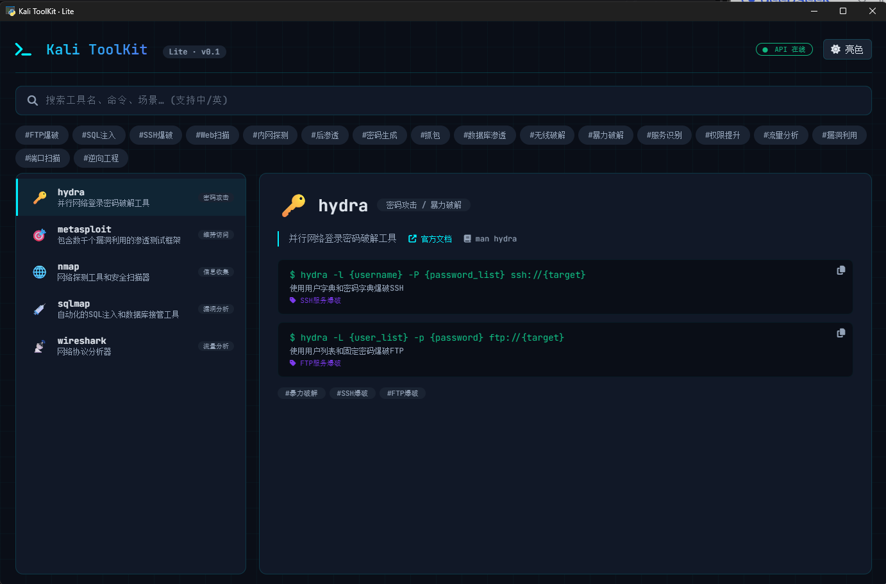

# 781 个 Kali 工具 + 2053 条命令，装进一个 20MB 的 exe：我开源了 Kali ToolKit

hello大家好，我是Malcode，一个专注于网安以及开发的人。

用 Kali 的人都懂一个痛点：**工具实在太多了。**

Kali 官方收录了七百多个工具，装完系统面对一长串名字——nmap、metasploit 这些熟面孔之外，还有大量你听都没听过的东西。每次想找个趁手的工具，要么去官网翻工具列表，要么现搜博客，网上搜出来的答案质量参差不齐，很多还是好几年前的旧文。

我就想：能不能把这些工具整理成一个可以本地查的"百科全书"？不要联网，不要装依赖，双击就能用，中文说明，连命令示例都给你准备好。

折腾了几个月，这个项目终于能拿出来见人了——**Kali ToolKit**，一个把 781 个 Kali 工具、2053 条命令示例打包进单个 exe 的离线查询工具。全部代码开源，MIT 协议。

GitHub 地址：`https://github.com/sheyunyang/kali-toolkit`，觉得有用欢迎点个 Star，这对独立开发者真的很重要。



## 一、它到底是个什么东西

一句话概括：**Kali Linux 工具百科全书 · 离线极客版**。

下载一个约 20MB 的 `KaliToolKit.exe`，双击运行，无需安装、无需联网，你就有了一部可以全文搜索的 Kali 工具手册。它收录了：

* 📚 **781 个工具**，覆盖信息收集、漏洞分析、Web 应用、密码攻击、无线攻击、逆向工程、取证、报告等 8 大分类

* 💻 **2053 条命令示例**，每条都带中文说明和使用场景，点击即可复制到剪贴板

* 🔍 **中英文混合搜索**，支持按工具名、描述、命令片段模糊匹配，300ms 防抖

* 🏷️ **标签与关联工具**：每个工具有功能标签，详情页还会推荐"常搭配使用"的其他工具

* 🎨 **暗色/亮色双主题**，右上角一键切换

* 🔄 **自动更新**：后台检查 GitHub Releases，发现新版本一键自更新，SHA-256 校验保证安全

打开程序，先是一段约 8 秒的开机动画——黑底、青色终端风字体，算是给极客的一点仪式感（嫌长点击任意处就能跳过）。主界面左侧是搜索框和工具列表，右侧是工具详情：中英文描述、所属分类、官方地址、man 手册页，以及可以直接复制的命令示例。

它适合谁？正在学渗透的新手（每个工具是干嘛的一目了然）、经常需要查命令的老手（比开浏览器搜快得多）、以及不装 Kali 但想了解安全工具的人（比如 Windows 用户）。

## 二、技术选型：怎么简单怎么来

这个项目我想控制复杂度，所以没有上 Electron 那种重方案。最终的技术栈是这样：

| 层   | 选型                         | 理由                                    |
| --- | -------------------------- | ------------------------------------- |
| 前端  | Vue 3 + 原生 CSS             | 单文件 HTML 就能跑，不构建不打包                   |
| 后端  | FastAPI + SQLite           | Python 一把梭，SQLite 单文件数据库，免安装免配置       |
| 桌面壳 | pywebview                  | 用系统自带 WebView 渲染页面，比 Electron 轻量一个数量级 |
| 打包  | PyInstaller                | 打成单 exe，用户拿到直接双击                      |
| 数据  | Kali 官网爬取 + DeepSeek AI 翻译 | 官网工具列表是权威来源，AI 负责批量翻译                 |

前后端通信就是最朴素的 HTTP：pywebview 启动一个 uvicorn 线程跑 FastAPI，前端 fetch `127.0.0.1` 的接口。没有 WebSocket，没有鉴权——本地工具不搞那些花活。

### 真·离线：所有依赖本地打包

市面上很多号称"离线"的工具，打开一看前端还在从 CDN 加载 Vue 和字体，断网直接白屏。这个项目从第一天就把所有第三方依赖——Vue 3、Font Awesome 图标、JetBrains Mono 字体——全部下载到本地目录一起打包，并且做了字体裁剪（去掉用不到的 ttf 回退和非拉丁语系子集），vendor 目录控制在 600KB 以内。断网、内网、虚拟机里，照跑不误。

### 后端：聚合查询，毫秒级响应

FastAPI 部分不到 200 行，数据库五张表：

```sql
CREATE TABLE IF NOT EXISTS tools (...);       -- 工具本体
CREATE TABLE IF NOT EXISTS commands (...);    -- 命令示例
CREATE TABLE IF NOT EXISTS tags (...);        -- 标签
CREATE TABLE IF NOT EXISTS tool_tags (...);   -- 工具-标签多对多
CREATE TABLE IF NOT EXISTS relations (...);   -- "常搭配使用"关联
```

接口设计上有两个刻意为之的取舍：

**列表与详情分离。** `/api/search` 只返回摘要（名字、分类、两行描述、标签），`/api/tool/{id}` 返回完整详情。选中工具时才拉详情，列表响应从"潜在几 MB"降到 54KB。

**批量聚合消灭 N+1。** tags、relations、commands 用 `WHERE tool_id IN (...)` 一次查出再分组，不管结果集多大，固定就是 4 条 SQL。

实测成绩：

| 接口                     | 响应大小  | 耗时    |
| ---------------------- | ----- | ----- |
| `/api/search?q=nmap`   | 8 KB  | 9 ms  |
| `/api/search`（100 条摘要） | 54 KB | 31 ms |
| `/api/tool/1`（详情）      | 1 KB  | 5 ms  |

781 条数据的体量，毫秒级响应完全够用。这里还有个反面教材：**schema 里原本建了 FTS5 全文索引表和三个同步触发器，结果发现 LIKE 查询毫秒级就返回，FTS5 反而要处理中文分词的额外复杂度——白建了。** 性能优化要对着真实数据量做，这个道理值得刻在显示器边框上。死代码已经删掉，同时给高频查询字段补了四个索引。

### 启动链路：健康检查代替赌运气

这类桌面工具的经典 bug 是"后端没起来前端就白屏"。常见的写法是 `time.sleep(2.5)` 赌后端两秒内启动，赌输了用户看白屏，赌赢了用户干等。

Kali ToolKit 的流程是：

1. 先 bind 一个 0 端口，拿到系统分配的空闲端口（彻底告别"用户机器 8000 端口被占导致静默失败"）；
2. 后台线程启动 uvicorn；
3. 每 200ms 轮询一次健康接口，拿到 200 **立刻**打开主窗口——后端多快起来，窗口就多快出现；
4. 前端通过 `?api_port=端口号` 拿到端口。`file://` 页面支持 query string，这是个少有人用但完全合法的技巧。

### 前端：一个 HTML 文件

`frontend/index.html` 不到 900 行，CSS 全部手写。暗色主题用 CSS 变量定义，亮色模式加一个 `body.light-mode` 类覆盖变量就完事：

```css
:root {
    --bg-primary: #0a0e17;
    --accent-cyan: #00f0ff;
    --border-glow: rgba(0, 240, 255, 0.15);
}
body.light-mode {
    --bg-primary: #f1f5f9;
    --border-glow: rgba(124, 58, 237, 0.2);
}
```

细节上有几个我觉得做得还不错的地方：搜索结果变化时如果当前选中的工具已经不在列表里，会自动选中第一个结果，保证右侧详情区永远有内容；后端连不上时顶部状态灯显示"API 离线"，每 10 秒自动重连检测；搜索框 300ms 防抖，不会每敲一个字母就打一次后端。

## 三、数据从哪来：爬虫 + AI 翻译的流水线

这是整个项目最重的部分，数据质量直接决定工具的可用性。

Kali 官网的工具页面是权威来源，但它的结构不太规整——有些工具有独立详情页，有些只有列表里的一行简介。爬虫分两步走：先抓 sitemap 拿到全部工具列表，再逐个抓详情页。中间产物是好几份 JSON，命名从 `raw`、`cleaned`、`enriched` 到 `final`，一看就知道是反复清洗过的。

原始数据拿到后有两个大问题：

**一是描述全是英文。** 七百多个工具的简介靠人肉翻译不现实，我接了 DeepSeek API 做批量翻译，每批 20 条、间隔限速，支持断点续传——跑到一半中断也不用从头再来。翻译质量比想象中好，术语基本不用人工改，秘诀是给了一条约束 prompt："保留 SQL注入、XSS、Payload、C2、ARP 这类专业术语，不要过度意译。"

**二是数据脏。** 抓下来的 HTML 里混着标签、多余的空白、重复条目，还有些工具的详情页根本不存在。清洗脚本前后跑了好多轮，中间用抽查脚本核验数据完整性，最终写进 SQLite 前还给常见工具补充了命令模板的中文说明，全库 2053 条。

整套流水线跑下来，scripts 目录里堆了二十多个脚本。说实话看着乱，但每一步都留有中间产物，哪一环出问题都能单独重跑——这种"笨办法"在数据处理上反而是最稳的。

## 四、自动更新：一个安全工具的自我修养

自动更新是这个版本的招牌功能之一：后台线程每 15 分钟查一次 GitHub Releases，发现新版本就在后台静默下载，前端弹横幅提示进度，用户点"立即重启"完成升级。

核心难点在"自替换"——Windows 上运行中的 exe 是被锁定的，没法直接覆盖自己。解法是一个经典的 bat 脚本跳板：

```bat
:wait
ping 127.0.0.1 -n 2 >nul
copy /y "__NEW__" "__OLD__" >nul 2>&1
if errorlevel 1 goto wait
start "" "__OLD__"
del "%~f0"
```

主程序生成这个脚本后先关闭所有窗口、再 `os._exit(0)` 立即退出释放文件锁，bat 循环尝试复制，成功后重启新 exe 再自删除。两个容易忽略的细节：bat 要按 **GBK** 编码写入（否则中文路径乱码复制失败）；退出前要先销毁 pywebview 窗口（否则界面僵死）。

**然后是整个功能里我最看重的安全设计：SHA-256 强制校验。**

很多软件的自动更新是"下载完直接装"，没有任何完整性验证。想清楚这个攻击面后背发凉：这是一个**安全工具**，用户全是渗透测试从业者，如果发布账号被盗或者下载链路被劫持，等于给所有用户推送一个"官方认证"的木马。

所以发布流程里除了 exe，还必须上传一份 `SHA256SUMS.txt`（就是 `certutil -hashfile` 的输出）。客户端下载完成后必须比对哈希，**校验不过直接拒绝安装**，文件删除、状态置错。成本只是发布时多一行命令，安全性天差地别。

安全行业有句话：trust but verify。自己的更新通道，必须 verify。

## 五、踩过的坑

**1. PyInstaller 打包后路径全崩。** 开发时一切正常，打成 exe 就找不到数据库了。排查半天才发现 frozen 状态下资源解压到了 `sys._MEIPASS` 临时目录：

```python
def get_base_dir():
    if getattr(sys, 'frozen', False):
        return sys._MEIPASS
    else:
        return os.path.dirname(os.path.abspath(__file__))
```

打包类项目第一次发布前一定要做完整的干净环境测试，别在自己开发机上测完就发。

**2. PyInstaller 的 `datas` 逐个文件声明，漏一个就白屏。** vendor 目录、数据库、schema 都要显式列进 `build.spec`，更好的做法是目录整体引入 `('frontend/vendor', 'frontend/vendor')`。

**3. 杀软误报。** 单文件 exe 加 PyInstaller 几乎是杀软误报的"标配组合"。这个没有技术解，只能在 README 里老实写明："如被杀软误杀请添加信任"。

**4. 隐式全局变量。** `copyText()` 里用了隐式全局 `event`，Chrome 系内核碰巧能跑，但这是标准外行为，换个内核就是运行时错误。现在显式传 `$event` 参数。这类问题静态看不出来，只有规范审查能抓到。

## 六、路线图

当前版本基础功能完整：781 个工具、8 大分类、中英文搜索、2053 条带中文说明的命令示例、真离线、一键安全更新。

接下来计划：

* **v0.3.0** — 工具收藏 + 搜索历史（LocalStorage 就能做，不引后端状态）

* **v0.4.0** — 标签数据完善：用 AI 流水线为全部 781 个工具生成标签和"常搭配工具"关联数据

* **v1.0.0** — 全平台支持（Linux/macOS 打包链路）+ 增量更新

## 七、最后的废话

做这个项目最初的动机其实很单纯：自己查命令的时候嫌麻烦。做完之后发现它对新手的价值可能更大——网络安全这行入门最难的不是技术，是"知道有什么工具可用"。希望 Kali ToolKit 能帮更多人跨过这道坎。

照例放免责声明：本项目仅供授权的网络安全测试和教育使用，使用者需遵守当地法律法规，不得用于非法用途，作者不对任何滥用行为负责。

如果你在找一款离线的 Kali 工具速查手册，不妨下载试试。有 bug 或者想加功能，GitHub Issues 见。

## 相关链接

* GitHub 仓库：<https://github.com/sheyunyang/kali-toolkit>

* 下载地址：<https://github.com/sheyunyang/kali-toolkit/releases>

* Kali 官方工具列表：<https://www.kali.org/tools/>

***

*项目代码：MIT License · 作者：Malcode*
